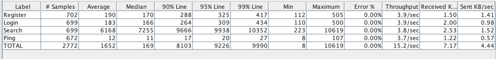

```sql
EXPLAIN 
SELECT * FROM users
WHERE name LIKE '%some%'
AND surname LIKE '%some%';

Gather  (cost=1000.00..19737.77 rows=1 width=583)
        Workers Planned: 2
->  Parallel Seq Scan on users  (cost=0.00..18737.67 rows=1 width=583)
Filter: (((name)::text ~~ '%some%'::text) AND ((surname)::text ~~ '%some%'::text))
```

```sql
EXPLAIN
SELECT * FROM users
WHERE name LIKE '%some%'
  AND surname LIKE '%some%';

Bitmap Heap Scan on users  (cost=52.00..56.02 rows=1 width=583)
Recheck Cond: (((name)::text ~~ '%some%'::text) AND ((surname)::text ~~ '%some%'::text))
->  Bitmap Index Scan on idx_users_name_surname_trgm  (cost=0.00..52.00 rows=1 width=0)
Index Cond: (((name)::text ~~ '%some%'::text) AND ((surname)::text ~~ '%some%'::text))
```
