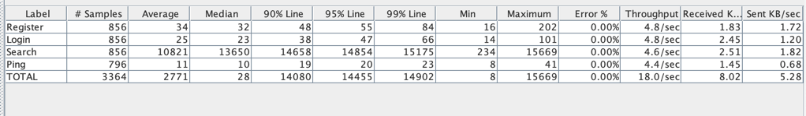
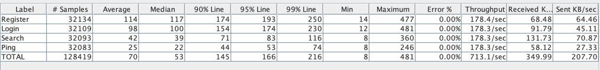

# Индексы & Нагрузочное тестирование

- В рамках задания необходимо ускорить операцию поиска пользователей по префиксу имени и фамилии.
- Спецификация метода представлена [тут](../src/main/resources/api/openapi.json).
- В БД находится минимум 1млн пользователей, которые были записаны через [скрипт](../src/main/resources/db/sql/users_inserts.sql).

### Стенд для нагрузочного тестирования

Использовалось отдельная виртуальная машина в облаке.

```
Platform: Intel Ice Lake
Cpu: 4
RAM: 8gb
SSD: 40gb
```

### Конфигурация теста

Полная конфигурация представлена jmeter [тут](social_load_test.jmx).
Короткое описание: постепенное наращивание активных юзеров до 60 в течение 60сек и удержание нагрузки в течение 180сек
```
Number of threads(users): 60
Rump-up period: 60s
Duration: 180s
```

Тесты запускались локально и смотрели на приложение развернутое в облаке.

Сценарий одного пользователя представлял из себя:
1. Регистрацию
2. Логин
3. Поиск по префиксу имени и фамилии (каждый параметр генерировался рандомно, одна заглавная буква в диапозоне и одна маленькая)
4. Пинг (скорее для отладки и понимания, что bottleneck не в веб-контейнере)

### Нагрузочное тестирование до создания индекса

Для начала проанализируем sql запрос, который используется для получения данных.

```sql
EXPLAIN
SELECT *
FROM users
WHERE lower(name) LIKE lower('some%')
  AND lower(surname) LIKE lower('some%');

Gather  (cost=1000.00..22215.58 rows=25 width=77)
        Workers Planned: 2
  ->  Parallel Seq Scan on users  (cost=0.00..21213.08 rows=10 width=77)
        Filter: ((lower((name)::text) ~~ 'some%'::text) AND (lower((surname)::text) ~~ 'some%'::text))
```

Как видим, для него будет производиться полный скан таблицы

Далее запустим нагрузочный тест. Ниже представлена таблица с результатами.



Результаты достаточно плачевные, около 15сек на поиск в 99p, а пропусканая способность не выше 4.6 запросов в секунду.

### Выбор индекса

По началу btree индекс кажется хорошим легковесным решением для построения дерева поиска по префиксам, однако стоит изучить pg_stats таблицы.

```sql
SELECT attname,
       n_distinct
FROM pg_stats
WHERE tablename = 'users'
  AND attname in ('surname', 'name');

attname | n_distinct 
---------+------------
 name    |       1063
 surname |       1006
```

Учитывая, что записей в таблице >1млн, процент уникальных значений имен и фамилий достаточно низкий, менее 1% от кол-ва записей.
В таком случае b-tree индекс нам не подойтет, так так при низкой селективности он неэффективен.
Для данного случая отлично подойдет gin индекс.

Создадим индекс и проанализируем запрос.

```sql
CREATE INDEX IF NOT EXISTS idx_users_name_surname_trgm
    ON users USING gin (LOWER(name) gin_trgm_ops, LOWER(surname) gin_trgm_ops);

EXPLAIN
SELECT *
FROM users
WHERE lower(name) LIKE lower('some%')
  AND lower(surname) LIKE lower('some%');

Bitmap Heap Scan on users  (cost=52.00..56.02 rows=1 width=583)
Recheck Cond: (((name)::text ~~ '%some%'::text) AND ((surname)::text ~~ '%some%'::text))
->  Bitmap Index Scan on idx_users_name_surname_trgm  (cost=0.00..52.00 rows=1 width=0)
Index Cond: (((name)::text ~~ '%some%'::text) AND ((surname)::text ~~ '%some%'::text))
```

Видим прирост производительности в попугаях почти в 20 раз.
Теперь осталось проверить, что синтетический результат нам не врет.

### Нагрузочное тестирование после создания индекса

Запускаем нагрузочный тест при той же конфигурации, но уже с созданным индексом.



Выигрышь в производительности поиска колосальный.
116мс в 99p, что в ~130 раз быстрее, чем было без индекса. 
Пропусканая способность так же подросла в ~38 раз, и составила 178 запросов в секунду.
